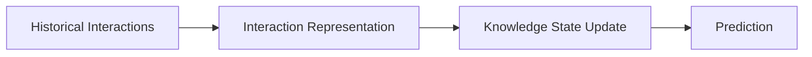
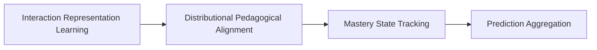
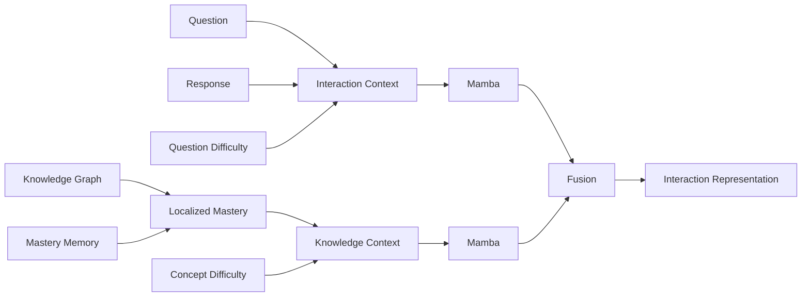
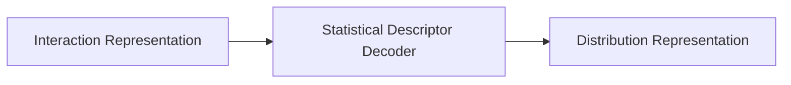
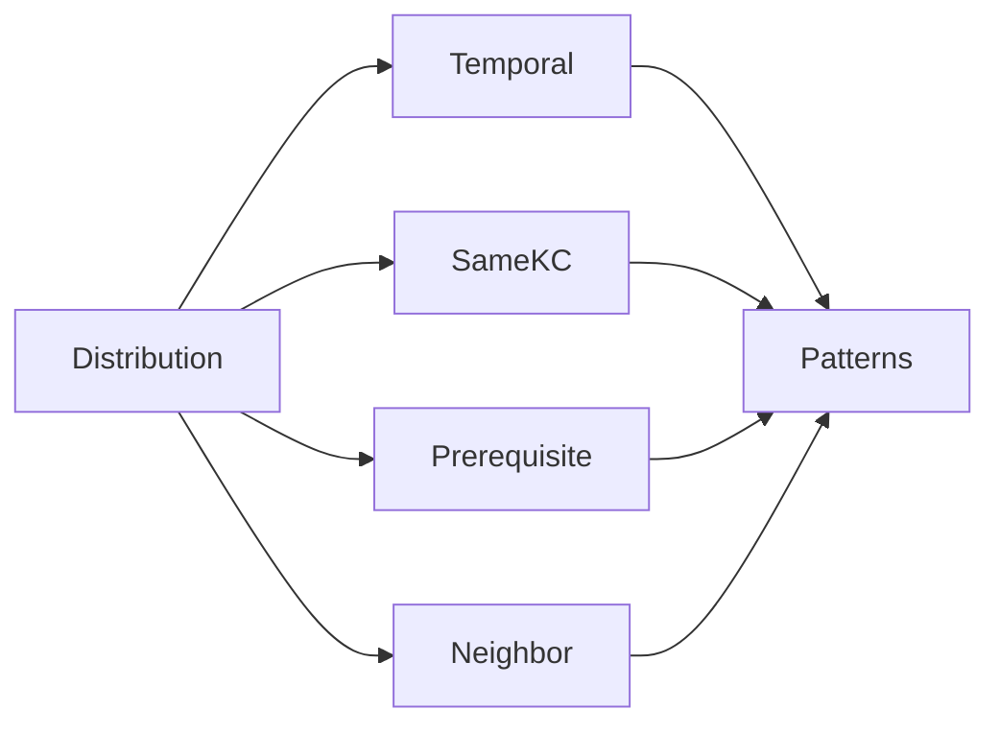
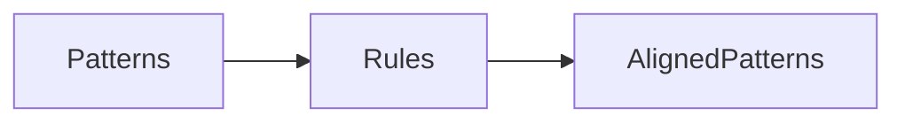
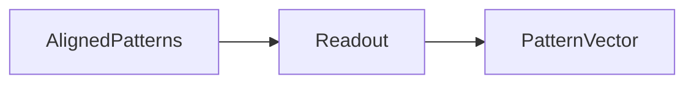
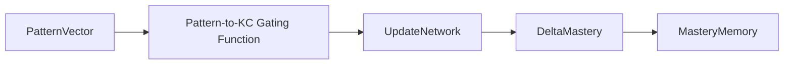
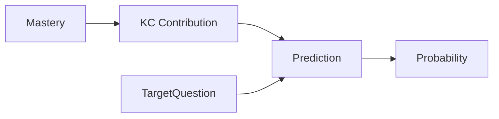

# Proposal 

## Động lực thiết kế

### Background

Knowledge Tracing (KT) hướng đến việc mô hình hóa sự tiến hóa của trạng thái tri thức học sinh thông qua chuỗi tương tác lịch sử nhằm dự đoán kết quả của các tương tác tiếp theo. Trong nhiều năm qua, các mô hình KT đã liên tục phát triển theo hướng tăng cường khả năng mô hình hóa chuỗi, khai thác cấu trúc tri thức, cũng như cải thiện khả năng diễn giải của quá trình suy luận.  

Các hướng nghiên cứu gần đây có thể được chia thành ba xu hướng chính:

* Tăng cường khả năng mô hình hóa biểu diễn tương tác (content-aware, topology-aware, semantic-aware);
* Tăng cường khả năng biểu diễn trạng thái tri thức thông qua các biểu diễn xác suất hoặc biểu diễn có xét đến uncertainty;
* Tăng cường khả năng diễn giải thông qua graph reasoning, neural-symbolic reasoning hoặc probabilistic reasoning.

Mặc dù khác nhau về kỹ thuật hiện thực, phần lớn các công trình vẫn tuân theo cùng một quy trình tổng quát:



Proposal hiện tại bắt đầu từ việc xem xét lại chính pipeline chung này.

### Quan sát nghiên cứu trước đây

Sau khi khảo sát các hướng nghiên cứu gần đây, có thể nhận thấy rằng phần lớn các mô hình khác nhau chủ yếu cải tiến một trong ba thành phần sau:

* Cách học biểu diễn của interaction;
* Cách biểu diễn mastery;
* Cách dự đoán kết quả.

Ví dụ,

- MCKT tăng cường biểu diễn interaction bằng semantic embedding và difficulty embedding.
- CMDKT đưa thêm topology của KC.
- GKT đưa graph vào knowledge representation.
- S²KT, UKT, KeenKT chuyển mastery sang dạng distribution.
- PSI-KT, NSKT và PLKT tăng khả năng diễn giải bằng nhiều cơ chế reasoning khác nhau.         

Tuy nhiên, hầu hết các hướng tiếp cận vẫn chia sẻ cùng một giả định:

> Interaction representation sau khi được học có thể được sử dụng trực tiếp để cập nhật knowledge state.

Nói cách khác, interaction representation đồng thời phải đảm nhiệm hai vai trò:

* Biểu diễn ngữ cảnh của tương tác;
* Mang toàn bộ bằng chứng cần thiết để cập nhật trạng thái tri thức.

Đây chính là giả định mà proposal này xem xét lại.

### Góc nhìn của đề xuất

Proposal này xuất phát từ một góc nhìn khác về quá trình học tập.

Một tương tác học tập không trực tiếp làm thay đổi trạng thái tri thức. Thay vào đó, mỗi tương tác trước hết tạo ra các bằng chứng (learning evidence) về hành vi học tập của học sinh. Chỉ sau khi các bằng chứng này được tổng hợp, tổ chức và diễn giải dưới góc nhìn sư phạm thì chúng mới trở thành cơ sở để cập nhật knowledge state.

Theo góc nhìn này, knowledge update không nên là phép biến đổi trực tiếp từ interaction representation sang mastery representation. Thay vào đó cần tồn tại một tầng trung gian đóng vai trò:

* Tổng hợp evidence;
* Tổ chức evidence;
* Điều chỉnh evidence;
* Lượng hóa mức độ đóng góp của evidence.

Proposal gọi tầng này là

**Distributional Pedagogical Alignment.**

### Các quy tắc lõi của đề xuất

Từ góc nhìn trên, framework được thiết kế dựa trên nguyên lý phân tách vai trò của từng không gian biểu diễn.

Thay vì để một biểu diễn duy nhất đồng thời đảm nhiệm toàn bộ quá trình từ interaction đến prediction, proposal chia quá trình này thành bốn tầng logic:

> - **Interaction Space**
>
>   - Mô hình hóa ngữ cảnh của từng interaction.
>   - Không quan tâm reasoning.
>
> - **Distribution Space**
>
>   - Biến interaction thành evidence.
>   - Hỗ trợ các phép:
>     - Tổng hợp Pattern.
>     - Alignment theo giá trị sư phạm.
>
> - **Knowledge Space**
>
>   - Evidence -> Mastery.
>
> - **Prediction Space**
>
>   - Mastery -> Prediction.

Mỗi tầng chỉ đảm nhiệm một mục tiêu duy nhất. Điều này giúp giảm sự pha trộn giữa biểu diễn ngữ cảnh, biểu diễn tri thức và biểu diễn dự đoán.

### Triết lý thiết kế

Từ các phân tích trên, proposal xây dựng một framework gồm bốn module liên tiếp.

- Module đầu tiên học biểu diễn ngữ cảnh của tương tác.

- Module thứ hai chuyển các biểu diễn này sang không gian phân phối để xây dựng các learning pattern và thực hiện điều chỉnh theo các nguyên lý sư phạm.

- Module thứ ba tổng hợp các pattern đã được điều chỉnh nhằm cập nhật knowledge state, đồng thời lượng hóa mức độ đóng góp của từng pattern lên từng Knowledge Component.

- Cuối cùng, module thứ tư tổng hợp knowledge state với thông tin của câu hỏi mục tiêu để sinh dự đoán, đồng thời lượng hóa mức độ đóng góp của từng Knowledge Component lên kết quả dự đoán.

Nhờ quá trình phân tách này, toàn bộ pipeline từ historical interactions đến prediction được tổ chức thành một chuỗi các bước có ý nghĩa sư phạm rõ ràng, trong đó mỗi tầng biểu diễn đảm nhiệm một vai trò riêng và hỗ trợ trực tiếp cho khả năng diễn giải nội tại của mô hình. Cấu trúc tổng thể của framework được trình bày trong phần tiếp theo. Nội dung này thống nhất với kiến trúc bốn module và bốn tầng biểu diễn của bản proposal hiện tại. 

---

## Mô hình tổng thể

Đề xuất xây dựng một framework KT gồm bốn module chính tương ứng với bốn giai đoạn của quá trình theo dõi trạng thái tri thức.

* **Học biểu diễn vector ẩn của tương tác lịch sử - Interaction Representation Learning**

  * Học biểu diễn ngữ cảnh của từng tương tác từ lịch sử học tập.

* **Điều chỉnh sư phạm trên biểu diễn phân phối - Distributional Pedagogical Alignment**

  * Chuyển đổi biểu diễn tương tác sang không gian phân phối.
  * Xây dựng các learning pattern theo nhiều góc nhìn sư phạm.
  * Điều chỉnh các pattern theo các nguyên lý sư phạm trước khi cập nhật mastery.

* **Theo dõi trạng thái tri thức - Mastery State Tracking**

  * Tổng hợp các pattern đã được điều chỉnh để cập nhật Knowledge State của học sinh.
  * Đồng thời mô hình hóa mức độ đóng góp của từng learning pattern lên từng KC nhằm phục vụ khả năng diễn giải nội tại của quá trình cập nhật tri thức.

* **Prediction Aggregation**

  * Tổng hợp Knowledge State và thông tin câu hỏi mục tiêu để dự đoán kết quả của tương tác tiếp theo.
  * Đồng thời mô hình hóa mức độ đóng góp của từng KC lên kết quả dự đoán nhằm phục vụ khả năng diễn giải của mô hình.

Toàn bộ framework được tổ chức thành bốn tầng biểu diễn liên tiếp:

* Interaction Space
* Distribution Space
* Knowledge Space
* Prediction Space

Cơ bản:



---

## Mô hình chi tiết

### 1. Interaction Representation Learning

Module đầu tiên chịu trách nhiệm học biểu diễn ngữ cảnh của từng interaction từ lịch sử học tập.

Đầu vào của module được chia thành hai nhóm thông tin với hai loại động lực học khác nhau.

* **Nhóm tương tác - Interaction Context**

  * Question Semantic
  * Student Response
  * Question Difficulty

* **Nhóm tri thức - Knowledge Context**

  * Mastery Memory
  * Knowledge Graph
  * Concept Difficulty

Trong đó, Mastery Memory không được sử dụng trực tiếp mà trước tiên được truy xuất theo ngữ cảnh của câu hỏi hiện tại thông qua Knowledge Graph để tạo thành biểu diễn mastery cục bộ.

Hai nhóm thông tin này được đưa qua hai phân nhánh Mamba song song nhằm học hai loại dynamics khác nhau:

* Dynamics của chuỗi tương tác.
* Dynamics của trạng thái tri thức cục bộ.

Sau đó, hai biểu diễn được hợp nhất để tạo thành biểu diễn interaction cuối cùng.



Cơ bản:

$$
\mathbf z_t = Fusion ( Mamba_{interaction}(I_t), Mamba_{knowledge}(K_t) )
$$

Trong đó

* $I_t$ là Interaction Context.
* $K_t$ là Knowledge Context.

---

### 2. Distributional Pedagogical Alignment

Module thứ hai thực hiện xây dựng và điều chỉnh learning pattern trên không gian phân phối.

Khác với PLKT, phân phối trong đề xuất không đại diện cho mastery belief hay learner belief.

Thay vào đó, phân phối đóng vai trò là **một không gian biểu diễn trung gian của interaction pattern**, cho phép thực hiện các phép tổng hợp và điều chỉnh theo lý thuyết sư phạm trước khi cập nhật Knowledge State.

Module này gồm bốn bước:

* Biến đổi biểu diễn phân phối - Distribution Projection
* Tổng hợp mẫu hình - Pattern Construction
* Tinh chỉnh sư phạm - Pedagogical Alignment
* Biến đổi vector - Pattern Readout

#### 2.1 Distribution Projection

Đầu tiên, biểu diễn interaction được chuyển sang biểu diễn phân phối.



Sơ bộ,

$$
h_t = \Phi(z_t)
$$

Trong đó

$$ h_t=(\alpha_t,\beta_t) $$

đối với Beta Distribution.

> ***Note***
> 
> Statistical Descriptor Decoder học phép ánh xạ từ interaction representation sang các tham số của phân phối.
> 
> Không gian phân phối không biểu diễn mastery mà chỉ đóng vai trò là không gian biểu diễn của interaction pattern.

#### 2.2 Pattern Construction

Sau khi thu được chuỗi phân phối, mô hình xây dựng nhiều learning pattern thông qua các Pattern Operator.

Pattern không được định nghĩa bởi số lượng interaction mà được định nghĩa bởi các phép tổng hợp cố định.

Đề xuất sử dụng:

* Theo thời gian - Temporal Pattern Operator
* Cùng KC - Same-Knowledge-Component Operator
* KC tiên quyết - Prerequisite Operator
* KC láng giềng - Neighbor Concept Operator



Sơ bộ,

$$
P_i = \mathcal A_i(H)
$$

> ***Note***
> 
> Mỗi Pattern Operator luôn mang cùng một ý nghĩa sư phạm.
> 
> Do đó, cấu trúc Pattern Representation luôn nhất quán giữa mọi học sinh bất kể lịch sử học tập có độ dài hay phân bố khác nhau.

#### 2.3 Pedagogical Alignment

Sau khi xây dựng các learning pattern, mô hình thực hiện điều chỉnh các pattern bằng tập luật sư phạm.

Khác với NSKT, các luật không trực tiếp suy luận mastery mà chỉ điều chỉnh biểu diễn phân phối nhằm đưa các learning pattern tiến gần hơn với các nguyên lý sư phạm.



Sơ bộ,

$$
\tilde P_i = Align(P_i,R_i)
$$

Trong đó

* $P_i$ là learning pattern ban đầu.
* $R_i$ là tập luật sư phạm.
* $\tilde P_i$ là pattern sau điều chỉnh.

> ***Note***
> 
> Pedagogical Alignment đóng vai trò như một cơ chế regularization trên không gian phân phối thay vì một hệ luật suy diễn.

#### 2.4 Pattern Readout

Sau khi hoàn thành quá trình điều chỉnh, mô hình ánh xạ các learning pattern trở lại không gian vector.



Sơ bộ,

$$
z'_i = Readout(\tilde P_i)
$$

Trong đó

$$
z' = [ z^{temp}, z^{same}, z^{pre}, z^{neighbor} ]
$$

là structured pattern representation.

> ***Note***
> 
> Pattern Vector không phải latent vector ngẫu nhiên mà là biểu diễn có cấu trúc, trong đó mỗi block luôn tương ứng với một loại learning pattern xác định.
> 
> Điều này giúp đảm bảo tính nhất quán của đầu vào cho quá trình cập nhật mastery.

---

### 3. Mastery State Tracking

Module thứ ba chịu trách nhiệm duy trì và cập nhật trạng thái tri thức của học sinh.

Ở đây, Knowledge State là một trạng thái tường minh của mô hình và được cập nhật trực tiếp từ structured pattern representation.

Ngoài việc cập nhật mastery, module còn học **mức độ đóng góp của từng learning pattern lên giới hạn KC liên quan** (gating function), từ đó cho phép truy vết quá trình hình thành Knowledge State sau mỗi interaction.



Sơ bộ,

$$
A_i = G(P_i)
$$

Trong đó

* $A_i$ biểu diễn mức độ ảnh hưởng của learning pattern thứ $i$ lên giới hạn các KC liên quan.

Sau đó,

$$
\Delta M = \sum_i A_i \odot U_i(M_t,P_i)
$$

Cuối cùng,

$$
M_{t+1} = M_t+\Delta M
$$

> ***Note***
> 
> Thay vì chỉ học trực tiếp hàm cập nhật mastery, mô hình đồng thời học thêm **Pattern-to-Knowledge Contribution** nhằm lượng hóa ảnh hưởng của từng learning pattern lên từng KC.
>
> Các trọng số đóng góp này không tham gia trực tiếp vào quá trình dự đoán mà đóng vai trò diễn giải nội tại cho quá trình cập nhật Knowledge State.
> 
> Nhờ đó, mô hình có thể trả lời các câu hỏi như:
> 
> * Learning pattern nào làm tăng mastery của một KC?
> * KC nào chịu ảnh hưởng mạnh nhất từ một learning pattern cụ thể?

---

### 4. Prediction Aggregation

Module cuối cùng thực hiện dự đoán kết quả của tương tác tiếp theo.

Đầu vào của module gồm:

* Knowledge State sau cập nhật.
* Biểu diễn của câu hỏi mục tiêu.

Ngoài xác suất dự đoán, module đồng thời **học mức độ đóng góp của từng KC** lên kết quả dự đoán nhằm cung cấp khả năng diễn giải của mô hình.



Sơ bộ,

$$
W = C(M_{t+1},q_{t+1})
$$

Trong đó

* $W=[w_1,w_2,\ldots,w_C]$ biểu diễn mức độ đóng góp của từng KC lên tương tác mục tiêu.

Sau đó,

$$
\hat y = f(M_{t+1},q_{t+1},W)
$$

> ***Note***
> 
> Prediction Aggregation không chỉ sinh ra xác suất trả lời đúng mà còn đồng thời sinh ra **KC Contribution**.
> 
> Kết hợp với **Pattern-to-Knowledge Contribution** từ Module 3, mô hình có thể truy vết toàn bộ chuỗi hình thành kết quả dự đoán:
> 
> ```text
> Historical Interactions
>         │
>         ▼
> Learning Patterns
>         │
>         ▼
> Pattern → Knowledge Contribution
>         │
>         ▼
> Updated Knowledge State
>         │
>         ▼
> Knowledge → Prediction Contribution
>         │
>         ▼
> Prediction
> ```
> 
> Do đó, khả năng diễn giải của mô hình được hình thành một cách **intrinsic** trong chính quá trình cập nhật tri thức và dự đoán, thay vì được bổ sung bởi một module giải thích độc lập sau khi mô hình đã hoàn thành dự đoán. 